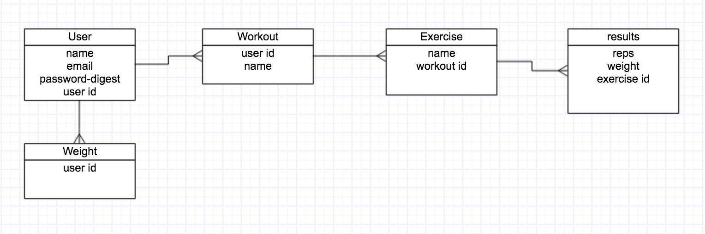
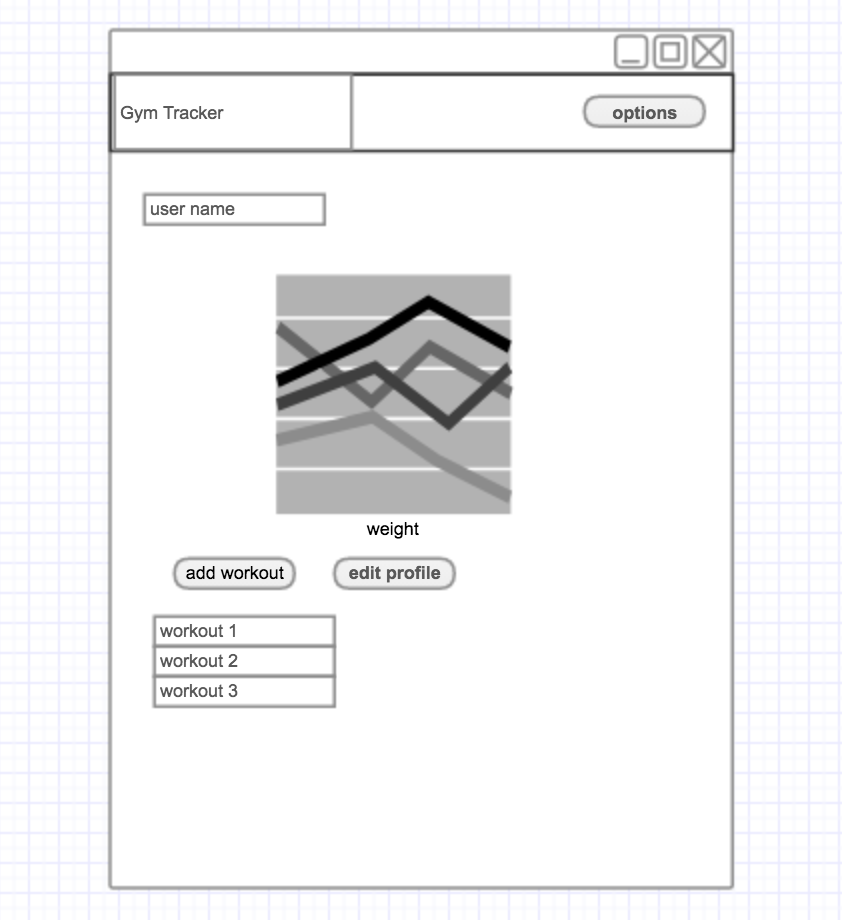

## GymTracker

GymTracker is a personal exercise log. It allows you to organize exercises into workout routines and lets you track you progress on each exercise with graphs.

Try it out [Here](https://tranquil-depths-56039.herokuapp.com/)

## How To Use
To begin, click the sign up button and provide your name, email, and a password. Next add your current weight so you can began tracking your progress. On your profile, you can create a new workout category, and keep track of all of the routines you have created. When you choose a workout, your brought to it's list of exercises. Here you can add exercises and edit the workout to change it's name or remove exercises from it. By selecting an exercise, you will be able to track doing a set and see your history with that exercise.

## Technologies Used
- Ruby on Rails
- PostgreSQL
- Bootstrap
- Chartkick
- Font Awesome
- jQuery-rails
- HTML and CSS

## User Stories
I tracked my user stories and progress with Trello. You can view the project timeline [here](https://trello.com/b/UhKLOflC/work-out-app).

## Data Model

## Wireframe
This is the basic layout of the app.

## Up Next
- First up would be the option to track other types of exercises like cardio or class workouts like yoga or spin.
- A timer for cardio and workouts, and maybe a run tracker.
- I would also like to add a social aspect where users can share their workouts and get ideas from other users.

## Issues
- chart x axis labels display id info of the database model.
- remove unused views and routes.
- desktop view is pretty boring.

## Shout Outs

- The creators of Rails
- The authors of the gems used
	- Bootstrap
	- Chartkick
	- Font Awesome
	- jQuery-rails
- My instructors and classmates for there help along the way.
